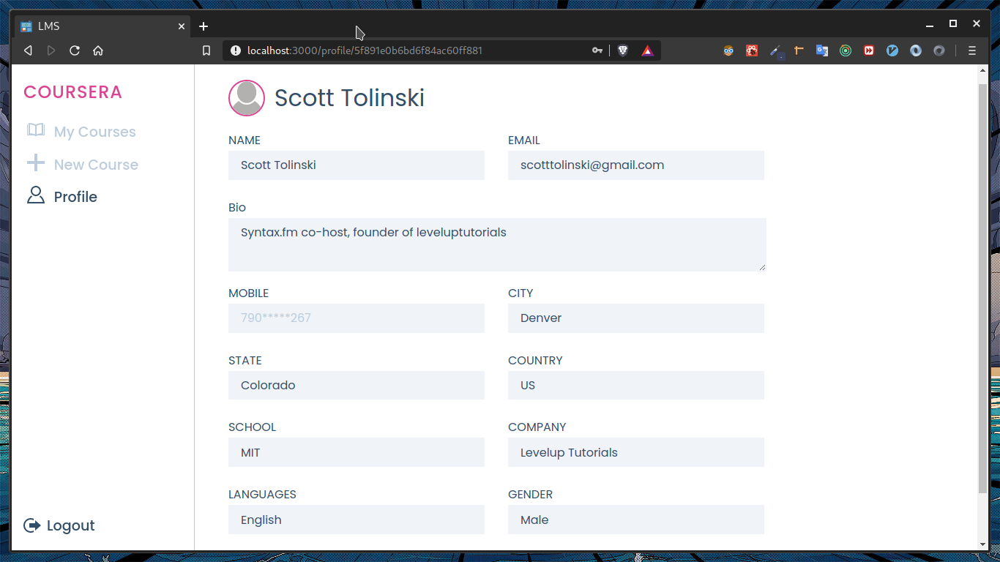

# Learning Management System

A simple learning management system that allows students to register for coures and faculty to create courses. The frontend is built with React and Redux. 

## Features

1. User signup/login/logout
2. Faculty can create courses
3. Students can register for courses

## UI

## Signup

## Login

## Explore (student only)

## My Courses

## New Course (faculty only)

## Profile

